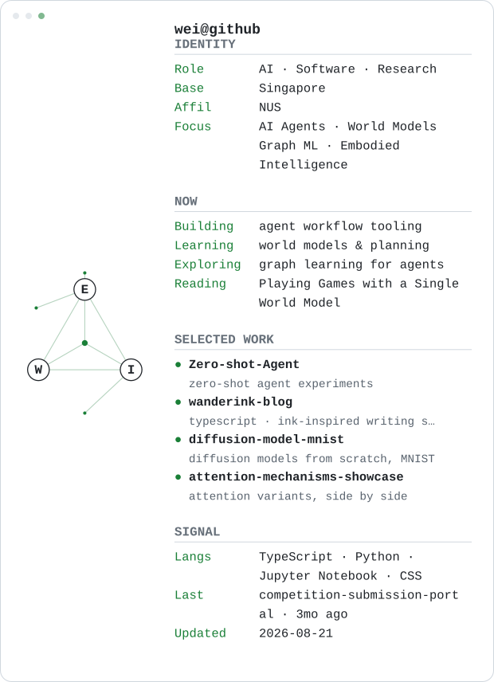

<!-- profile:svg:start -->
<picture>
  <source media="(prefers-color-scheme: dark)" srcset="./assets/generated/profile-dark.svg">
  
</picture>
<!-- profile:svg:end -->

## Why I keep learning

I don't know exactly what I'm learning for yet.

Maybe companionship. Maybe intelligence. Maybe building something that can
remember. Maybe simply understanding the systems that will shape the world
I live in.

The future is becoming more predictable, more optimized, more algorithmic.
That is precisely why I want to keep learning: I don't want to merely live
inside systems that predict people. I want to understand them — and, one
day, help decide what should be automated, what should be created, and what
should remain human.

So I study agents, world models, and the mathematics of learning. Some of
that turns into the projects above. Most of it just changes how I see
things. Both are fine.

<!--

Notes to future me:

- Edit profile.config.yml to change identity / focus / NOW / featured
  projects. The card regenerates daily via GitHub Actions (or on demand
  from the Actions tab → Refresh profile → Run workflow).
- The SVGs under assets/generated/ are machine-written; never edit them.

-->

---

*Generated by [readmefetch](https://github.com/pruefsumme/readmefetch)-inspired tooling — MIT. Fetch-and-render infrastructure concept reused from the original; design and code are this repo's own.*
